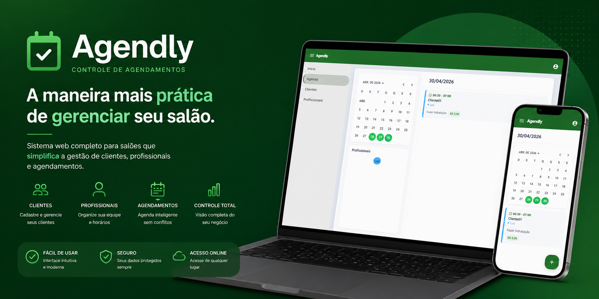

# 📅 Agendly - Controle de Agendamentos

  

Sistema web de agendamento para salões, desenvolvido para oferecer praticidade na gestão diária e organização dos horários dos clientes.

---

## 🚀 Sobre o Projeto

O **Agendly** é uma plataforma web criada para modernizar e simplificar o gerenciamento de salões e negócios que trabalham com atendimento por horário marcado.

O sistema permite controlar clientes, profissionais e agendamentos em um único lugar, oferecendo uma experiência rápida, intuitiva e eficiente para o dia a dia.

Além disso, possui validação inteligente de conflitos de horários, garantindo uma agenda organizada e sem sobreposição de atendimentos.

---

## ✨ Principais Funcionalidades

✅ Cadastro e gerenciamento de clientes  
✅ Cadastro de profissionais e equipe  
✅ Controle completo de agendamentos  
✅ Validação de conflitos de horários  
✅ Agenda visual prática e intuitiva  
✅ Interface moderna e fácil de usar  
✅ Sistema responsivo para diferentes dispositivos  

---

## 🛠️ Tecnologias Utilizadas

- Angular  
- TypeScript  
- Spring Boot  
- Java  
- MySQL  
- HTML / CSS  

---

## 🎯 Objetivo

Entregar uma solução simples, moderna e eficiente para empresas que precisam organizar seus atendimentos, reduzir falhas manuais e ganhar produtividade.

---

## 📸 Preview

  

---

## 📞 Contato / Mais Informações

Caso tenha interesse no sistema, parceria comercial ou queira saber mais:

📧 Email: furmannluiz@gmail.com 

---

Desenvolvido por Luiz Furmann 🚀

